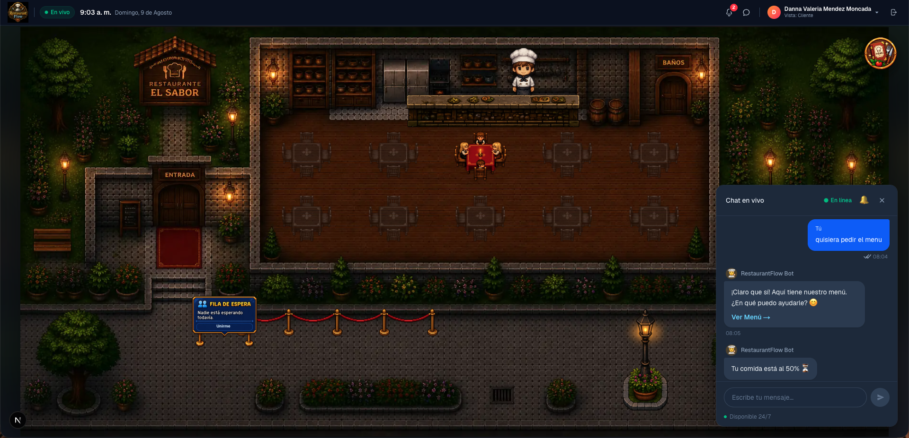

# RestaurantFlow

Plataforma de gestión de restaurante en tiempo real: mapa interactivo de mesas, pedidos con progreso en vivo, chat con bot de IA y paneles dedicados para cliente, mesero, cocina y administración.



## ¿Qué es?

RestaurantFlow conecta a clientes, meseros, cocina y administración sobre un mismo estado en vivo: cuando una mesa cambia, un pedido avanza o un plato queda listo, todos los roles lo ven al instante sin recargar la página.

- **Cliente**: explora el mapa del restaurante, hace fila de espera, pide desde el chat con un bot asistido por IA y sigue el progreso de su pedido con notificaciones (25%, 50%, 90%, 100%).
- **Mesero**: visualiza sus mesas asignadas, atiende solicitudes y coordina con cocina.
- **Cocina**: gestiona el estado de cada plato y ve la cola de pedidos priorizada.
- **Administración**: dashboard con métricas operativas del restaurante en vivo.

## Stack

**Frontend** — `Frontend/restaurant-flow`
- Next.js (App Router) + React + TypeScript
- Tailwind CSS

**Backend** — `Backend`
- FastAPI + Pydantic v2
- PostgreSQL con SQLAlchemy 2.x (async) y Alembic
- Agentes en background (predictor de progreso/ETA, supervisor de alertas, analizador y priorizador de pedidos)
- IA generativa para el chat y el análisis de pedidos, con reglas determinísticas de respaldo si la IA no está disponible

## Estructura del repositorio

```text
RestaurantFlow/
├── Frontend/restaurant-flow/   # App Next.js (mapa, chat, paneles por rol)
└── Backend/                    # API FastAPI, agentes y persistencia
```

Cada carpeta tiene su propio README con instrucciones detalladas de instalación y configuración.

## Cómo correrlo en local

1. **Backend** (`Backend/`): crea un entorno virtual, instala `requirements.txt`, copia `.env.example` a `.env` y completa tus propias credenciales, aplica las migraciones con Alembic y levanta `uvicorn main:app --reload`.
2. **Frontend** (`Frontend/restaurant-flow/`): instala dependencias con `npm install` y ejecuta `npm run dev`.
3. Abre el frontend en el navegador; por defecto se conecta al backend local.

Ninguna credencial real vive en este repositorio: las claves de base de datos, IA y servicios en tiempo real se configuran vía variables de entorno locales, nunca versionadas.

## Estado

Proyecto construido en el contexto de un hackathon, en desarrollo activo.
